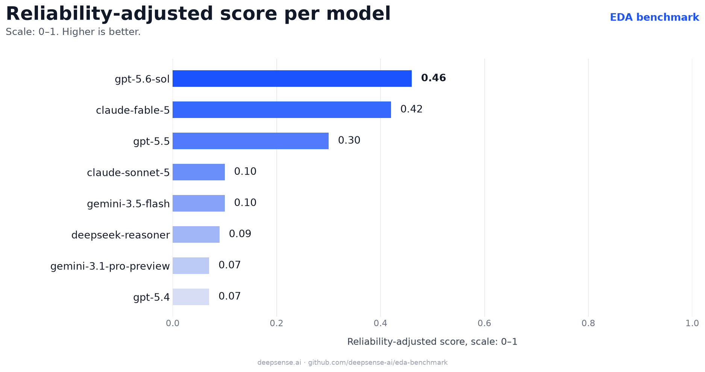
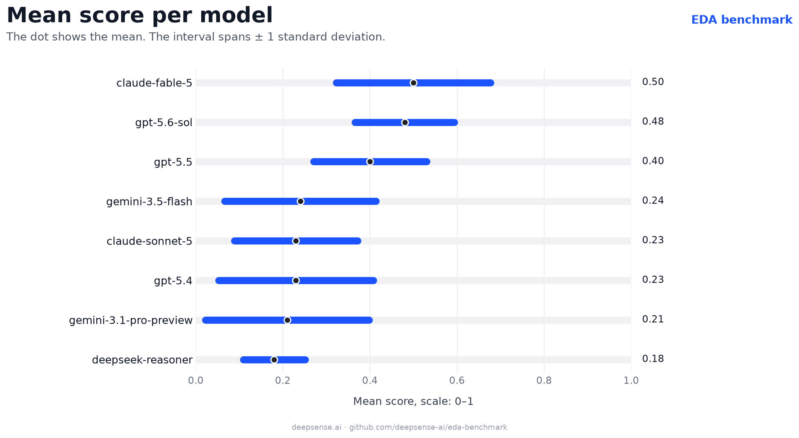
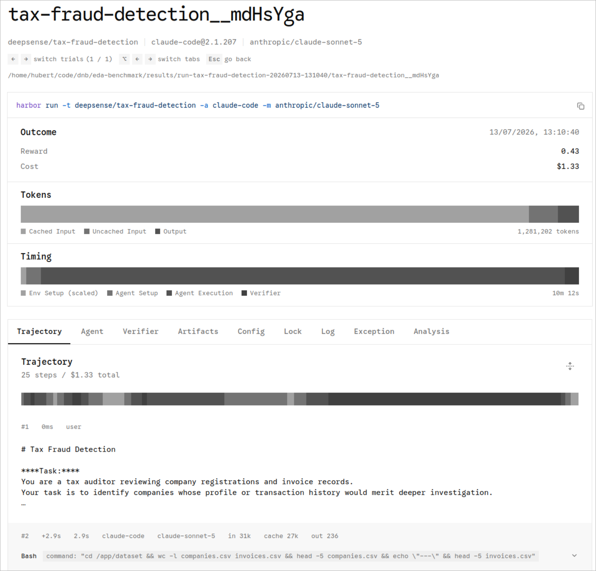

[](https://creativecommons.org/licenses/by-nc-nd/4.0/)

<div align="center">

# EDA Benchmark

### Synthetic Data & Evaluation Methods for Reliable Data-Analysis Agents

**A benchmark and 10 synthetic data-analysis tasks for testing whether AI agents can solve structured analytical problems accurately and repeatably across diverse domains.**

[Leaderboard](#leaderboard) · [Available datasets](#available-example-datasets) · [Open `tasks/`](./tasks) · [Benchmark overview](#benchmark-overview) · [Related work](#related-work) · [Run it locally](#run-the-benchmark) · [Work with us](#work-with-us)

</div>

---

## Why this repository exists

AI models are rapidly evolving from chatbots into **agents**: systems that inspect files, clean and combine data, detect anomalies, reconstruct events, and produce structured analytical outputs.

This shift raises a new question:

> **Can an AI agent solve diverse data-analysis tasks accurately and reliably across repeated runs?**

Most benchmarks focus on accuracy, completion, or isolated task performance. For evaluation and training, that is not enough. A model may solve a task once, but fail when the same type of task is repeated. It may perform well on average, but behave too unpredictably to be trusted without additional verification.

**EDA Benchmark** is designed to measure that combination of analytical quality and repeatability.

This repository contains an publicly available example of our approach to creating and evaluating synthetic data-analysis tasks. It demonstrates how synthetic datasets, controlled task design, and repeatability-aware metrics can be used to assess model and agent capabilities.

This repo includes **10 publicly available synthetic data-analysis tasks** spanning environmental monitoring, healthcare, industrial systems, finance, operations, data cleaning, anomaly detection, and structured reasoning. They are intentionally limited in difficulty, number and scope, so AI labs and researchers can quickly inspect the benchmark structure, run evaluations, and understand the type of custom datasets we can build at larger scale.

---

## Leaderboard (2026.07.14)

The latest benchmark results are shown below. They give a quick view of how current models compare when evaluated not only for analytical quality, but also for repeatability across runs.







Detailed trajectories, outputs, reports, and artifacts are available in the [`results`](./results) directory.

---

## Available example datasets

This repository contains **10 publicly available synthetic data-analysis tasks**. You can inspect them directly in the [`tasks/`](./tasks) directory.

| Dataset | Analytical task |
|---|---|
| [`air-quality-audit`](./tasks/air-quality-audit) | Identify faulty stations in an air-quality monitoring network. |
| [`cleaning-service`](./tasks/cleaning-service) | Compute employee salaries from inconsistent operational records. |
| [`hospital`](./tasks/hospital) | Infer likely deceased patients from a compensation registry. |
| [`identify-unusual-values`](./tasks/identify-unusual-values) | Detect unusual values in a synthetic stroke dataset. |
| [`parsing-values-task`](./tasks/parsing-values-task) | Parse inconsistent transaction values and identify anomalous records. |
| [`reactor-meltdown`](./tasks/reactor-meltdown) | Reconstruct failure propagation across reactor subsystems. |
| [`solar-farm-daily-yield`](./tasks/solar-farm-daily-yield) | Calculate daily energy yield from inconsistent solar telemetry. |
| [`store-audit`](./tasks/store-audit) | Reconstruct store revenue after a point-of-sale outage. |
| [`tax-fraud-detection`](./tasks/tax-fraud-detection) | Identify anomalous companies from registry and invoice data. |
| [`the-heirs-estate`](./tasks/the-heirs-estate) | Trace inheritance relationships and calculate account balances. |

The tasks are not intended to represent one industry or one business workflow. They are controlled analytical problems drawn from diverse domains. Each task provides synthetic data, a clearly defined objective, and a ground truth that enables reproducible evaluation.

Together, they test practical data-analysis capabilities such as data cleaning, parsing, aggregation, anomaly detection, time-series analysis, causal reconstruction, and reasoning over structured records.

These public tasks are examples of our methodology. For AI labs, we can create larger, harder, domain-specific datasets with custom generators, controlled difficulty levels, and evaluation criteria matched to the capabilities being trained or tested.

---

## What we offer

At **deepsense.ai**, we help AI labs build better models for agentic AI by providing:

- **custom synthetic datasets** for evaluation and training,
- **data-analysis benchmark tasks** across selected domains and capabilities,
- **evaluation methods** focused on usefulness, reliability, and repeatability,
- **simulation environments** for multi-step reasoning and analytical workflows,
- **delivery formats** adapted to each lab’s internal workflow.

Our datasets are designed for labs building frontier models, agentic systems, and other AI systems that need to perform reliably on data-analysis workflows.

We specialize in data-analysis tasks, including:

- exploratory data analysis,
- data cleaning and structured extraction,
- anomaly detection and time-series analysis,
- multi-step reasoning over structured and semi-structured data,
- decision-support workflows.

This repository is a public example of that work: it contains 10 synthetic data-analysis tasks, benchmark code, evaluation results, and reproducible run instructions.

---

## Why synthetic data matters

Synthetic datasets are especially valuable for model evaluation because they can be designed, controlled, and regenerated.

Our synthetic datasets are:

- **original**: not scraped, repackaged, or lightly transformed from existing sources,
- **controlled**: generated from simulators where difficulty, structure, and constraints can be adjusted,
- **realistic**: designed around plausible domain contexts, data-generating processes, and analytical workflows,
- **evaluation-ready**: created with clear expected outputs, scoring logic, and failure definitions,
- **customizable**: adapted to the capabilities an AI lab wants to evaluate or improve.

Because we build the generators behind the data, we can control task complexity, introduce targeted failure modes, regenerate fresh instances, and adapt domains and evaluation criteria to a lab's training or evaluation goals.

---

## Benchmark overview

**EDA Benchmark** is a benchmark for testing how reliably LLMs and agentic systems solve synthetic data-analysis tasks.

For each task, a model receives one or more datasets, a defined analytical objective, and an expected output format. Its answer is evaluated against ground truth.

The benchmark measures both analytical quality and consistency across repeated runs. This is important because an agent that succeeds only intermittently creates additional verification cost and is less useful in real analytical workflows.

The benchmark reports a reliability-adjusted score that rewards analytical quality and penalizes instability across repeated runs.

---

## What the problems look like

The benchmark problems are controlled synthetic data-analysis tasks from diverse domains. They may involve environmental sensors, healthcare records, financial transactions, industrial telemetry, operational data, or structured historical records.

Depending on the task, the model may need to clean inconsistent fields, combine sources, identify anomalies, reconstruct sequences of events, calculate an aggregate, or infer a target set from the available evidence.

For every task, the model must:

1. inspect the provided data,
2. determine the analytical method appropriate to the problem,
3. derive the requested result,
4. return a structured answer that can be compared with ground truth,
5. do this reliably across repeated runs.

This makes EDA Benchmark useful for testing practical data-analysis capabilities, repeatability, and the ability to produce structured answers rather than merely plausible explanations.

---

## What this benchmark evaluates

EDA Benchmark focuses on three practical questions:

### 1. Does the model solve the analytical task correctly?

The benchmark measures whether the model’s answer matches the task-specific ground truth, not just whether the reasoning sounds plausible.

### 2. Can the model work reliably with realistic data imperfections?

Tasks may include inconsistent formats, incomplete records, multiple data sources, noise, or confounding patterns.

### 3. Is performance repeatable?

Each model is evaluated across multiple trajectories per task. This makes it possible to detect models that sometimes perform well but are too unstable for repeated use.

---

## Evaluation method

The benchmark reports the following descriptors:

| Metric | Meaning |
|---|---|
| `ms` | Mean score. Used as an estimate of average analytical quality. |
| `CoV` | Coefficient of variation. Used to capture relative instability across repeated trajectories. |
| `Reliability-adjusted score` | Score combining average analytical quality and repeatability. |

`Reliability-adjusted score` is defined as: `Reliability-adjusted score = ms * exp(-2.25 * CoV^0.88)`

The instability parameters are adapted from the loss-side parametrization used in prospect theory. They provide a practical way to express the idea that reduced repeatability should lower the score in a nonlinear way.

The goal is to summarize a deployment-oriented intuition:

> A model is more reliable when it is both accurate on average and sufficiently repeatable to support trust in repeated use.

In this benchmark, `Reliability-adjusted score` is bounded between `0` and `1`.

The benchmark does not define a universal deployment threshold. Acceptable performance depends on the target capability, task risk, and required level of human verification.

The reliability adjustment is adapted from the methodology introduced in our earlier Business Utility Evaluation work. In EDA Benchmark, it is used as a domain-neutral way to summarize the trade-off between analytical quality and repeatability; it does not claim to measure business value.

---

## How scoring works

Each model is evaluated on **five trajectories per problem**.

For each trajectory:

- the model must produce an answer in the expected JSON format,
- the answer is compared with one ground truth dictionary,
- the trajectory score is calculated using the dedicated performance metric like Jaccard score,
- failed trajectories receive a score of `0.0`.

A trajectory is treated as failed if:

- it does not produce a JSON answer file in the expected format, or
- it reaches the task-specific timeout limit (eg. 600 or 1200 seconds).

All models are evaluated using their provider-specific harness, for example Claude Code for Anthropic models. If they don't have such, they use opencode.
Harnesses use the default setup, without custom instructions such as `agents.md`. 
Models are evaluated with their default temperature settings and with the highest available reasoning-effort variant, such as `high` or `xhigh`, where applicable.

---

## Models

Model names follow the naming used by [LiteLLM](https://models.litellm.ai/).

The model, agent, and reasoning-effort configuration used in the benchmark is stored in:
[`harbor/model-benchmark.yaml`](./harbor/model-benchmark.yaml)

Example configuration:

```yaml
  - model_name: anthropic/claude-fable-5
    name: claude-code
    kwargs:
      reasoning_effort: xhigh

  - model_name: anthropic/claude-sonnet-5
    name: claude-code
    kwargs:
      reasoning_effort: xhigh

  - model_name: openai/gpt-5.5
    name: codex
    kwargs:
      reasoning_effort: xhigh

  - model_name: openai/gpt-5.4
    name: codex
    kwargs:
      reasoning_effort: xhigh

  - model_name: google/gemini-3.1-pro-preview
    name: gemini-cli
    kwargs:
      reasoning_effort: high

  - model_name: deepseek/deepseek-reasoner
    name: opencode
    kwargs:
      reasoning_effort: high


```

---

## Repository structure

```text
.
├── harbor/                  # Benchmark configuration and Harbor setup
├── results/                 # Evaluation results, trajectories, and artifacts
├── tasks/                   # 10 synthetic data-analysis tasks
├── Makefile                 # Convenience commands for running the benchmark
└── README.md                # Benchmark documentation and landing page
```

---

## Run the benchmark

EDA Benchmark uses [Harbor](https://github.com/harbor-framework/harbor) as the framework for creating and running problems.

### Requirements

- Python `3.12+`
- [`uv`](https://docs.astral.sh/uv/) installed system-wide
- GNU Make
- Docker
- API keys for the model providers you want to evaluate

### Quick start

Initialize the environment:

```bash
make init
```

Fill in the API keys in:

```text
harbor/.env
```

Run a simple test:

```bash
make run TASK=air-quality-audit AGENT=codex MODEL=openai/gpt-5.5
```

Or with specific reasoning effort:

```bash
make run TASK=air-quality-audit AGENT=codex MODEL=openai/gpt-5.5 EXTRA='--ak reasoning_effort=xhigh'
```

Run a full benchmark for one task:

```bash
make run-benchmark TASK=air-quality-audit
```

To open the results viewer, run `make ui` then click the link to local server that will be given.

<div align="center">

</div>

---

## Make commands

| Command                                                                   | Description |
|---------------------------------------------------------------------------|---|
| `make init`                                                               | Installs Harbor dependencies and creates `harbor/.env` from the template if it does not exist. |
| `make env TASK=air-quality-audit`                                         | Opens an interactive Docker environment for a problem. |
| `make test TASK=air-quality-audit`                                        | Runs the problem with the oracle agent using one attempt and executes the reference solution. |
| `make run TASK=air-quality-audit MODEL=openai/gpt-5.5 AGENT=opencode`     | Runs one model and agent on one problem using one attempt, then appends a report to `results.csv`. |
| `make run-benchmark TASK=air-quality-audit`                               | Runs every model entry from `harbor/model-benchmark.yaml` on one problem. |
| `make run-benchmark-all-tasks`                                            | Runs the benchmark configuration across all valid problems in `tasks/`. |
| `make ui`                                                                 | Opens the Harbor results viewer for `results/`. |


---

## Related work

The reliability-adjustment approach used in this benchmark is informed by our earlier [Business Utility Evaluation work](https://github.com/deepsense-ai/agent-based-simulation-benchmark). That work focuses on business-process simulations; this repository applies the same quality-and-repeatability principle to a broader set of synthetic data-analysis tasks. The methodology is also described in [the research paper](https://deepsense.ai/resource/business-utility-of-large-language-models-as-exploratory-data-analysis-agents/?utm_source=GitHub&utm_medium=Post_BU_Eval_11_06_26&utm_campaign=Readme).

---

## Work with us

This open repository shows a small example of our synthetic data and evaluation methodology.

For AI labs, we can deliver custom datasets, task generators, and evaluation environments tailored to specific model-development needs, domains, and target capabilities.

We can help you answer questions such as:

- How well does your model perform on the analytical capabilities that matter for your use case?
- Is performance stable across repeated runs?
- Which data conditions or reasoning steps cause failures?
- How does model usefulness change as task difficulty increases?
- Can synthetic data improve training, evaluation, or post-training workflows?
- How long does a benchmark remain useful as model capabilities improve?

Depending on your needs, we can deliver:

- raw synthetic datasets,
- benchmark repositories,
- simulation functions that generate new tasks,
- custom evaluation methods,
- model evaluation reports,
- integration with your internal evaluation pipeline.

To discuss a custom dataset or evaluation project, learn more here: [https://deepsense.ai/tech-expertise/llms-rag/custom-synthetic-datasets-for-llm-vlm-evaluation-and-training/](https://deepsense.ai/tech-expertise/llms-rag/custom-synthetic-datasets-for-llm-vlm-evaluation-and-training/?utm_source=GitHub&utm_medium=Post_BU_Eval_11_06_25&utm_campaign=Landing)

---

## License

This dataset is licensed under the [**Creative Commons Attribution-NonCommercial-NoDerivatives 4.0 International License: CC BY-NC-ND 4.0**](https://creativecommons.org/licenses/by-nc-nd/4.0/).

You may share the dataset in its original, unmodified form, provided that proper attribution is given.

You may not modify, transform, or build upon the dataset.

Commercial use of the dataset is not permitted.

For commercial licensing inquiries, get in touch here: [https://deepsense.ai/contact-us](https://deepsense.ai/contact-us/?utm_source=GitHub&utm_medium=Post_BU_Eval_11_06_26&utm_campaign=Contact)

---

<div align="center">

**Synthetic data and evaluation methods for reliable data-analysis agents.**

Built by [deepsense.ai](https://deepsense.ai/)

</div>
